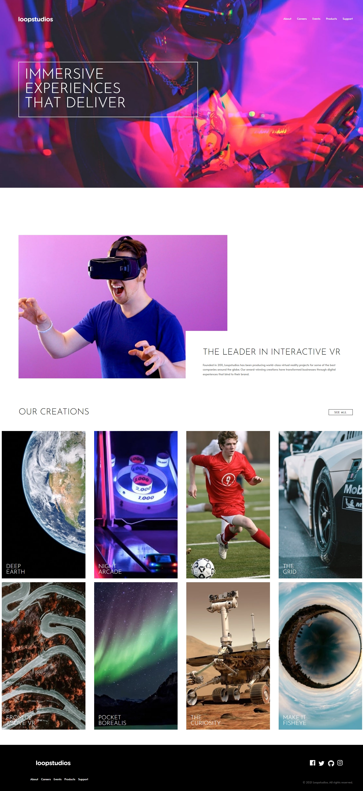

# Loop Studio Website

This is a solution to the Loop Studio project, showcasing an immersive experience with a modern and interactive design.

## Table of Contents

- [Overview](#overview)
- [Features](#features)
- [Usage](#usage)
- [Technologies](#technologies)
- [Acknowledgments](#acknowledgments)
- [Contributing](#contributing)
- [License](#license)
- [Contact](#contact)

## Overview

Loop Studio is a web application designed to showcase the company’s leading position in creating interactive VR experiences. It features a modern, responsive design and an engaging user interface, highlighting the company's various projects and creations.

## Features

- **Responsive Design:** Ensures optimal viewing across different devices, from desktops to mobile phones.
- **Interactive Experience:** Provides an immersive and engaging experience for users exploring the site.
- **Navigation:** Easy-to-use navigation menus, both for desktop and mobile views.
- **Showcase of Projects:** Highlights various virtual reality projects and creations.

## Usage

- **Explore Projects:** Scroll through the site to see various interactive VR projects.
- **Navigation:** Use the header or mobile navigation menu to access different sections of the website.

## Technologies

- **HTML5** for structuring the webpage.
- **CSS3** for styling and responsive design.
- **JavaScript** for client-side logic and interactivity.
- **GSAP:** Utilized for animations and smooth transitions.

## Acknowledgments

- [GSAP](https://greensock.com/gsap/) for providing powerful animation tools.
- [Frontend Mentor](https://www.frontendmentor.io) for the inspiration and design assets.

## Contributing

If you'd like to contribute to the Loop Studio project, please fork this repository and submit a pull request.

## License

This project is licensed under the MIT License. See the LICENSE.txt file for details.

## Contact

If you have any questions or feedback, please don't hesitate to contact me at [peekaboo29266@gmail.com] or [https://github.com/Code2926].
